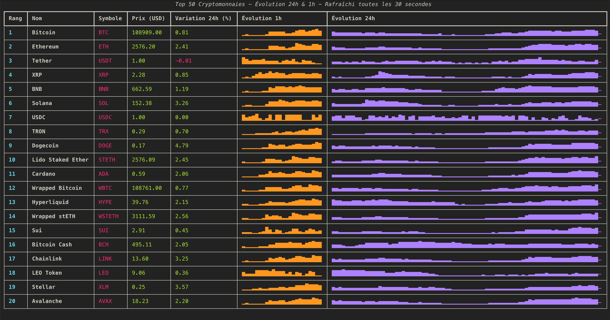

# Crypto htop 20 - Terminal Display



A simple Python script to display the top 20 cryptocurrencies in the terminal with a colored table.

## 🚀 Quick Start (Recommended)

### Download and Install

1. **Download** the latest release from GitHub:
   - [crypto-htop v1.1.1](https://github.com/magikcypress/crypto-htop/releases/tag/v1.1.1)

2. **Extract** the archive:

   ```bash
   tar -xzf crypto-htop-v1.1.1-Darwin-arm64.tar.gz
   ```

3. **Install** globally:

   ```bash
   cd crypto-htop-v1.1.1-Darwin-arm64
   ./install.sh
   ```

4. **Use** from anywhere:

   ```bash
   crypto-htop
   ```

## 📊 Features

- **Real-time data** from CoinGecko API
- **Top 20 cryptocurrencies** by market capitalization
- **Colored table** with price evolution charts
- **Auto-refresh** every 30 seconds
- **Sparkline charts** for 24h and 1h price evolution
- **Error handling** for network issues
- **Ultra-fast startup** (optimized binary)

## 🖥️ System Requirements

- **macOS ARM64** (Apple Silicon) - M1, M2, M3
- **No additional dependencies** required (everything is bundled)

## 📊 Usage

Run the script:

```bash
crypto-htop
```

The script displays:

- **Rank** and **symbol** of each cryptocurrency
- **Current price** in USD
- **24h variation** (green if positive, red if negative)
- **24h evolution chart** (sparkline)
- **1h evolution chart** (sparkline)

To stop the script, press `Ctrl+C` in the terminal.

## 🔧 Development Installation

### Prerequisites

- Python 3.7 or higher
- pip

### Installation with virtual environment

1. **Clone the project**

   ```bash
   git clone https://github.com/magikcypress/crypto-htop.git
   cd crypto-htop
   ```

2. **Create a virtual environment**

   ```bash
   python -m venv venv
   ```

3. **Activate the virtual environment**

   **On macOS/Linux:**

   ```bash
   source venv/bin/activate
   ```

   **On Windows:**

   ```bash
   venv\Scripts\activate
   ```

4. **Install dependencies**

   ```bash
   pip install -r requirements.txt
   ```

5. **Run the script**

   ```bash
   python crypto_htop.py
   ```

## 🛠️ Dependencies

- `requests` : For API calls
- `rich` : For colored display and real-time refresh

## 🔧 Customization

You can easily modify the script to:

- Change the number of cryptocurrencies displayed (currently 20)
- Add other columns (volume, market cap, etc.)
- Modify colors
- Change currency (EUR, BTC, etc.)

## 📄 License

This project is licensed under the MIT License. See the [LICENSE](LICENSE) file for details.

## 🤝 Contributing

Contributions are welcome! Feel free to:

- Report bugs
- Suggest improvements
- Add new features

## 🚀 Releases

### Latest Release: v1.1.1

- **Onefile mode** - Single executable, no complex structure
- **Auto-quarantine removal** - No more "Python.framework is damaged" errors
- **Ultra-fast startup** - Optimized for instant launch
- **macOS ARM64** compatibility

### Previous Releases

- **v1.1.0**: Auto-remove macOS quarantine
- **v1.0.9**: Fixed install script for onedir mode
- **v1.0.8**: All required files at root
- **v1.0.7**: Binary at archive root
- **v1.0.6**: Ultra-fast startup (onedir mode)
- **v1.0.5**: Optimized binary size (23% smaller)
- **v1.0.4**: Excluded unnecessary modules
- **v1.0.3**: All dependencies bundled
- **v1.0.2**: English interface
- **v1.0.1**: Initial release

### Create a release

```bash
# Create a binary for the release
./build_release.sh 1.1.2

# Publish to GitHub
./publish_release.sh 1.1.2 "Release notes"
```

## 🐛 Troubleshooting

### macOS "Python.framework is damaged" error

If you see this error, run:

```bash
xattr -dr com.apple.quarantine /path/to/crypto-htop
```

The install script automatically handles this for you.

### Installation issues

Make sure you have write permissions to `/opt/homebrew/bin/` or `~/bin/`.

## 📞 Support

If you encounter any problems or have questions, please open an issue on GitHub.
