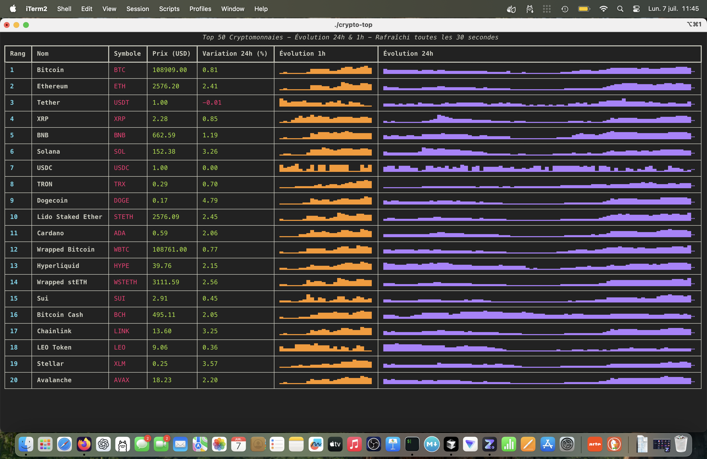

# Crypto Top 20 - Terminal Display



A simple Python script to display the top 20 cryptocurrencies in the terminal with a colored table.

## 🚀 Installation

### Prerequisites

- Python 3.7 or higher
- pip

### Installation with virtual environment

1. **Clone or download the project**

   ```bash
   git clone <repo-url>
   cd crypto-top
   ```

2. **Create a virtual environment**

   ```bash
   python -m venv venv
   ```

3. **Activate the virtual environment**

   **On macOS/Linux:**

   ```bash
   source venv/bin/activate
   ```

   **On Windows:**

   ```bash
   venv\Scripts\activate
   ```

4. **Install dependencies**

   ```bash
   pip install -r requirements.txt
   ```

## 📊 Usage

Run the script:

```bash
python crypto_top.py
```

The script:

- Immediately displays the table of the top 20 cryptocurrencies
- Automatically refreshes data every **30 seconds**
- Shows:
  - Cryptocurrency rank
  - Full name
  - Symbol
  - Current price in USD
  - 24h variation (green if positive, red if negative)
  - **24h evolution chart** (sparkline)
  - **1h evolution chart** (sparkline)

To stop the script, press `Ctrl+C` in the terminal.

## 🛠️ Dependencies

- `requests` : For API calls
- `rich` : For colored display and real-time refresh

## 📝 Features

- Real-time data retrieval via CoinGecko API
- Display of top 20 cryptocurrencies by market capitalization
- Colored and formatted table with evolution charts
- Automatic refresh every 30 seconds
- Immediate display on launch
- Connection error handling
- Sparkline charts to visualize price evolution over 24h and 1h

## 🔧 Customization

You can easily modify the script to:

- Change the number of cryptocurrencies displayed (currently 20)
- Add other columns (volume, market cap, etc.)
- Modify colors
- Change currency (EUR, BTC, etc.)

## 📄 License

This project is licensed under the MIT License. See the [LICENSE](LICENSE) file for details.

## 🤝 Contributing

Contributions are welcome! Feel free to:

- Report bugs
- Suggest improvements
- Add new features

## 🚀 Releases

### Installation from releases

1. **Download** the latest release from GitHub
2. **Extract** the archive: `tar -xzf crypto-top-v1.0.0-Darwin-arm64.tar.gz`
3. **Install**: `cd crypto-top-v1.0.0-Darwin-arm64 && ./install.sh`
4. **Use**: `crypto-top`

### Create a release

```bash
# Create a binary for the release
./build_release.sh 1.0.0

# The archive will be created: crypto-top-v1.0.0-Darwin-arm64.tar.gz
```

## 📞 Support

If you encounter any problems or have questions, please open an issue on GitHub.
